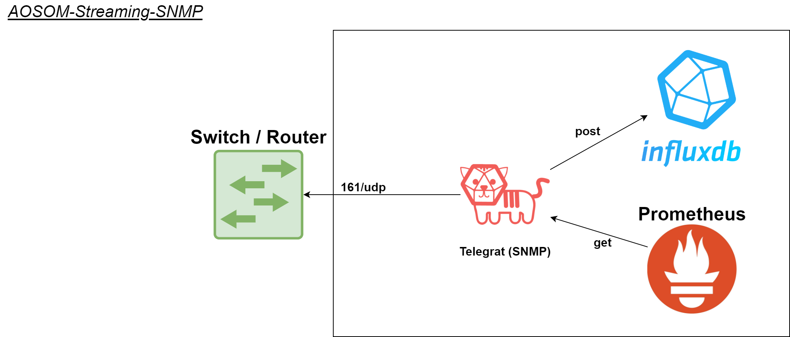

# aosom-streaming-snmp

Version v0.1.0 [2021-11-16]<br>
<br>
Tested with: [apstra/telegraf:1.20.3]<br>



# Using Aosom-streaming-snmp

## RUN
1) Edit <b>.env</b><br>
2) Edit <b>docker-compose.yml</b> - in "command" section add required INPUT SNMP files ie. <b>telegraf-snmp-INPUT-SNMP_jnxOperating.conf</b><br>
3) ``docker-compose start`` <br>


## Debug
1) Run command ``docker-compose start`` <br>
2) Try query from inside container: ``docker exec -it aosom-streaming_telegraf-snmp-juniper bash`` - snmpwalk command ie: <br>
&nbsp; ``snmpwalk -v 3 -l authpriv -u user1snmpv3 -a MD5 -A "Juniper123" -x AES -X "Juniper123" <IP> .1.3.6.1.2.1.1.1``


## Juniper SNMPv3 example configuration
```
snmp {
    contact "Jhone Doe, +1234567890";
    v3 {
        usm {
            local-engine {
                user user1snmpv3 {
                    authentication-md5 {
                        authentication-password "Juniper123";
                    }
                    privacy-aes128 {
                        privacy-password "Juniper123";
                    }
                }
            }
        }
        vacm {
            security-to-group {
                security-model usm {
                    security-name user1snmpv3 {
                        group GROUP1;
                    }
                }
            }
            access {
                group GROUP1 {
                  default-context-prefix {
                        security-model usm {
                            security-level authentication {
                                read-view all;
                            }
                        }
                    }
                }
            }
        }
    
    }
    view all {
        oid .1;
    }
routing-instance-access;
}
```